#

#### Trabalho realizado para a disciplina Projeto Integrador III - Desenvolvimento de Sistemas Dinâmicos Baseados na Web.

#### Integrantes do Grupo:

&nbsp; &nbsp; &nbsp; Dayane Scheffemacher Terencio
  
&nbsp; &nbsp; &nbsp; Gabriele Buss Rockenbach

&nbsp; &nbsp; &nbsp; Jean Carlos Lopes da Silva

&nbsp; &nbsp; &nbsp; Leticia Carvalho de Lima

&nbsp; &nbsp; &nbsp; Michel de Quadros Krüger

#

### Objetivo do projeto

O presente projeto tem como objetivo a idealização e construção das telas e protótipos navegáveis, de acordo com o diagrama de caso de uso e diagrama de classes realizados na primeira etapa do propjeto. 

#

### Diagrama de Caso de Uso

&nbsp;

#

### Diagrama de Classes

&nbsp;

#

### Telas

&nbsp;

Nesta etapa do projeto, realizamos a construção das telas de catastro na visão de cada ator do sistema como foi solicitado. Além disso, decidimos construir também uma visão do sistema na perspectiva de administrador.  

Segue abaixo as imagens referentes a cada tela construída:

&nbsp;

#### Telas de Cadastro:

&nbsp;

|   | 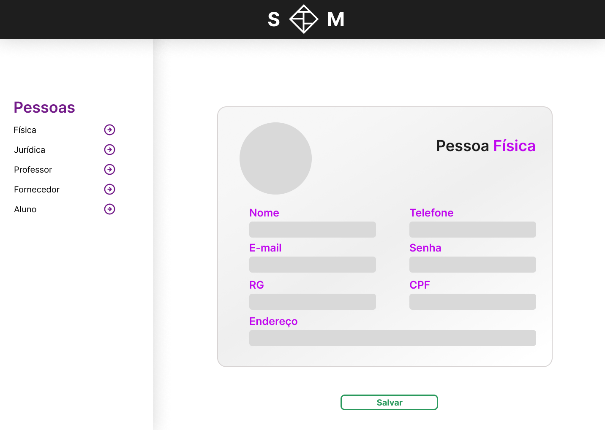  |
|      :-------------------------:          |        :-------------------------:       |
|         **Tela de seleção**               |     **Tela de cadastro Pessoa Física**   |

&nbsp;

|   | 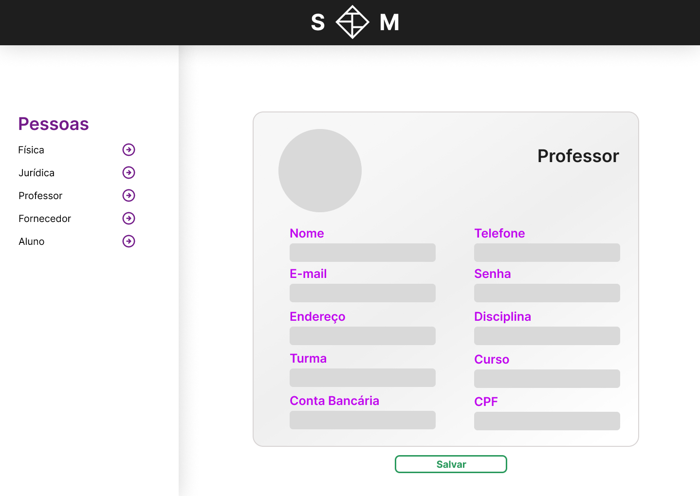  |
|      :-------------------------:          |        :-------------------------:       |
|   **Tela de cadastro Pessoa Jurídica**    |      **Tela de cadastro Professor**      |

&nbsp;

|   | 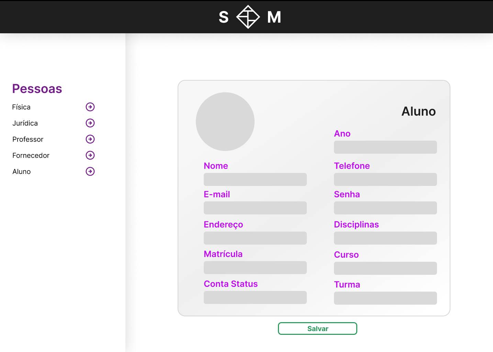  |
|      :-------------------------:          |        :-------------------------:       |
|      **Tela de cadastro Fornecedor**      |        **Tela de cadastro Aluno**        |

&nbsp;
#
&nbsp;

#### Telas na visão de Administrador:

&nbsp;

|                |          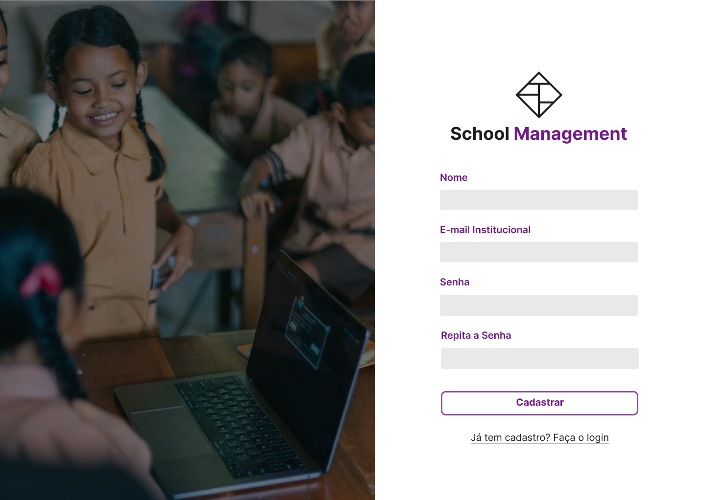          |
|          :-------------------------:          |            :-------------------------:           |
|  **Tela de login na visão de administrador**  |  **Tela de cadastro na visão de administrador**  |

&nbsp;
   
|                 |                     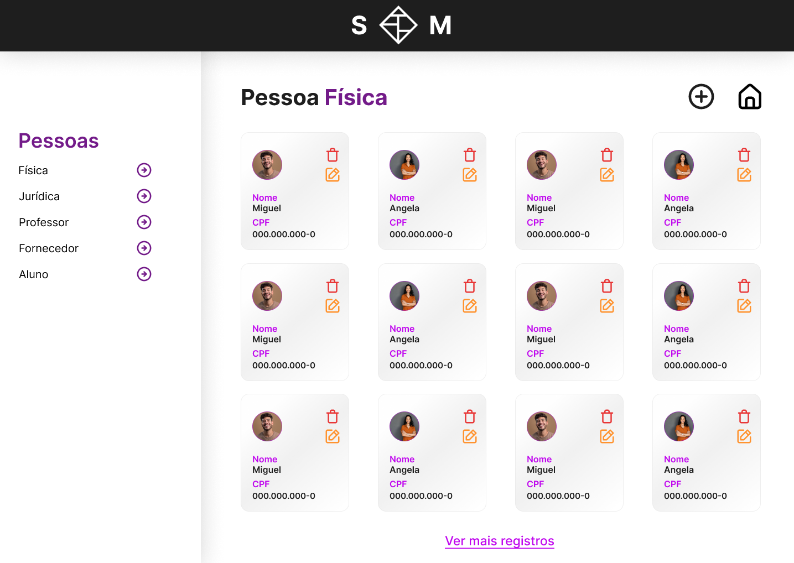                  |
|          :-------------------------:          |                       :-------------------------:                   |
|   **Tela inicial na visão de administrador**  |  **Tela de pessoas físicas cadastradas na visão de administrador**  |

&nbsp;

|                                         |                     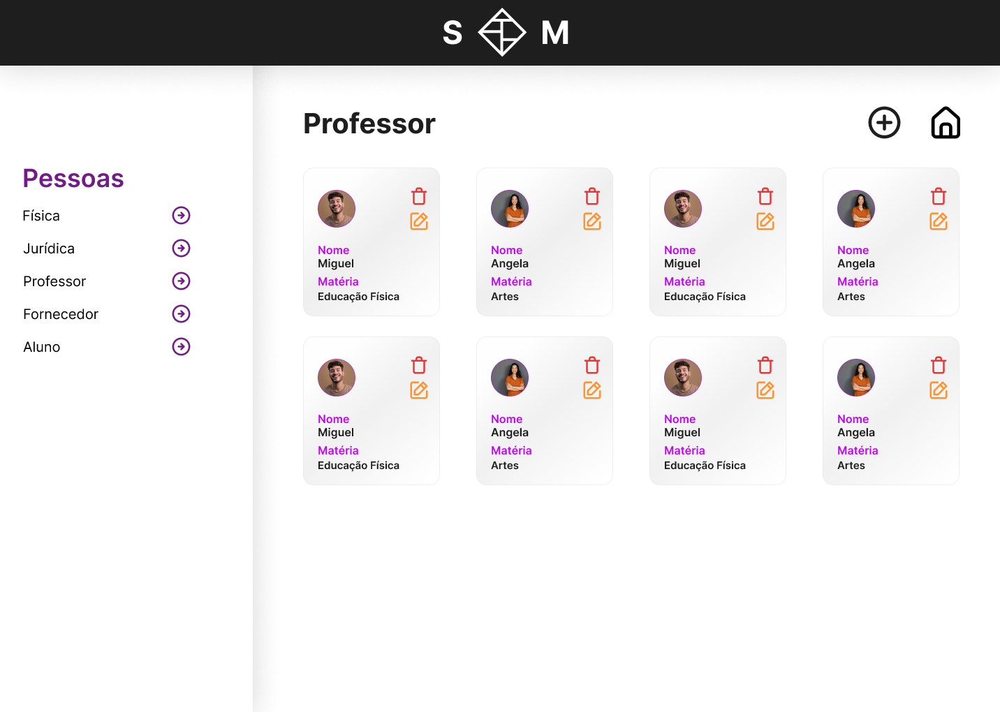                  |
|                   :-------------------------:                          |                       :-------------------------:                   |
|   **Tela de pessoas jurídicas cadastradas na visão de administrador**  |    **Tela de professores cadastrados na visão de administrador**    |

&nbsp;

|                                         |                     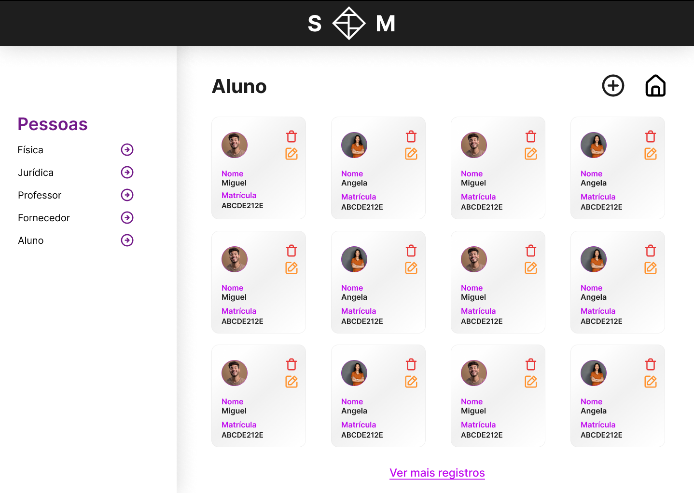                  |
|                   :-------------------------:                          |                       :-------------------------:                   |
|      **Tela de fornecedores cadastrados na visão de administrador**    |       **Tela de alunos cadastrados na visão de administrador**      |

&nbsp;

|                                         |                     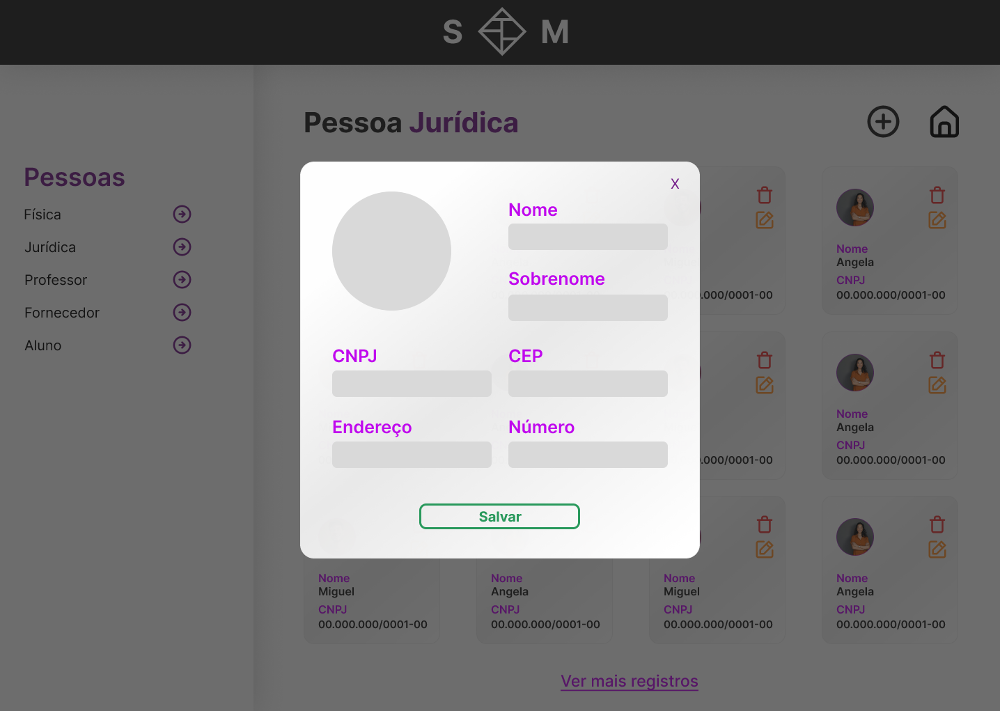                  |
|                   :-------------------------:                          |                       :-------------------------:                   |
|      **Tela de adição de pessoa física na visão de administrador**     |   **Tela de adição de pessoa jurídica na visão de administrador**   |

&nbsp;

|                                         |                     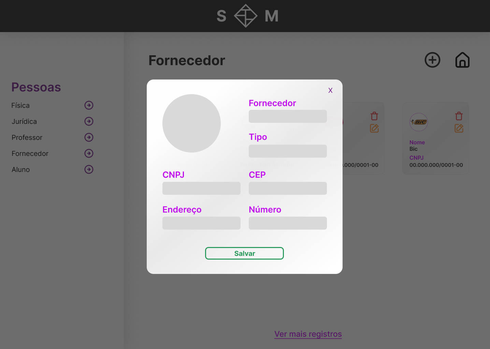                 |
|                   :-------------------------:                          |                       :-------------------------:                   |
|        **Tela de adição de professor na visão de administrador**       |      **Tela de adição de fornecedor na visão de administrador**     |

&nbsp;

|                                        |                                      |
|                   :-------------------------:                          |                       :-------------------------:                   |
|          **Tela de adição de aluno na visão de administrador**         |    **Tela de edição de pessoa física na visão de administrador**    |

&nbsp;

|                                        |                     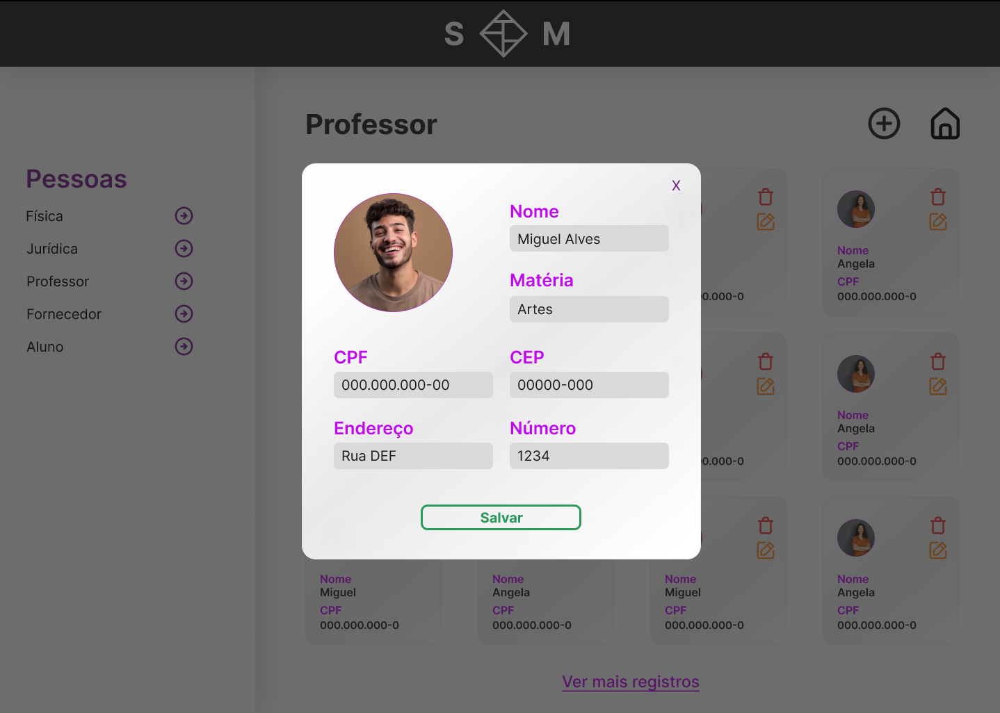                 |
|                   :-------------------------:                          |                       :-------------------------:                   |
|    **Tela de edição de pessoa jurídica na visão de administrador**     |       **Tela de edição de professor na visão de administrador**     |

&nbsp;

|                                        |                     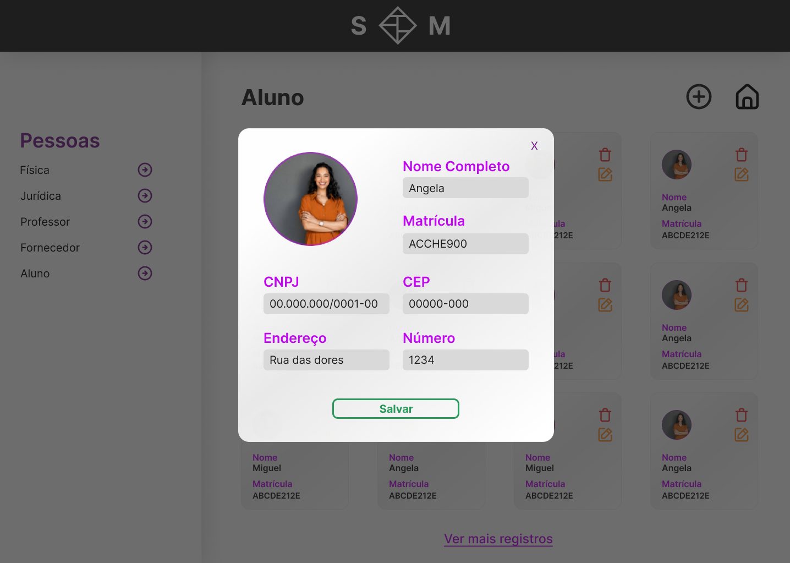                 |
|                   :-------------------------:                          |                       :-------------------------:                   |
|      **Tela de edição de fornecedor na visão de administrador**        |          **Tela de edição de aluno na visão de administrador**      |

#

### Link das telas no Figma:

**Telas de cadastro:** (https://www.figma.com/file/6xaQsbVlMU6QF9lk4ROmnF/Gest%C3%A3o-Escolar?type=design&node-id=87-434&mode=design&t=HDF9mGlUleF2IB2Z-0)

**Telas na visão de administrador:** (https://www.figma.com/file/6xaQsbVlMU6QF9lk4ROmnF/Gest%C3%A3o-Escolar?type=design&node-id=0-1&mode=design&t=39tf8ZZhwbVoWUat-0)

#

### Link do protótipo navegável no Figma:

**Telas de cadastro:** (https://www.figma.com/proto/6xaQsbVlMU6QF9lk4ROmnF/Gest%C3%A3o-Escolar?type=design&node-id=87-457&t=GiVGlmZ108tG6XxD-0&scaling=min-zoom&page-id=87%3A434&starting-point-node-id=87%3A457)

**Telas na visão de administrador:** (https://www.figma.com/proto/6xaQsbVlMU6QF9lk4ROmnF/Gest%C3%A3o-Escolar?type=design&node-id=1-2&t=MdIB3TLUMmfwE2gs-0&scaling=scale-down-width&page-id=0%3A1&starting-point-node-id=1%3A2)
